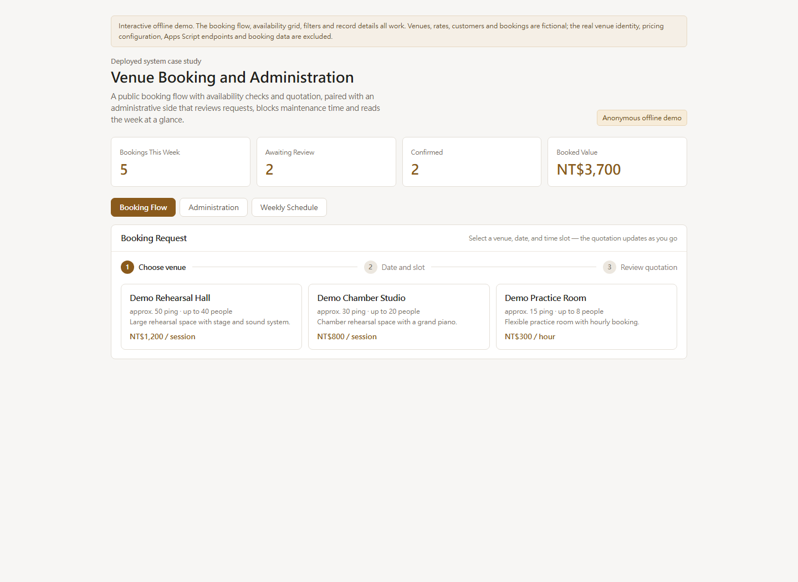
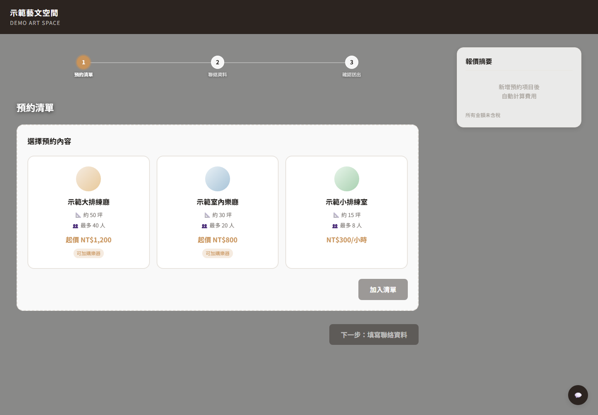
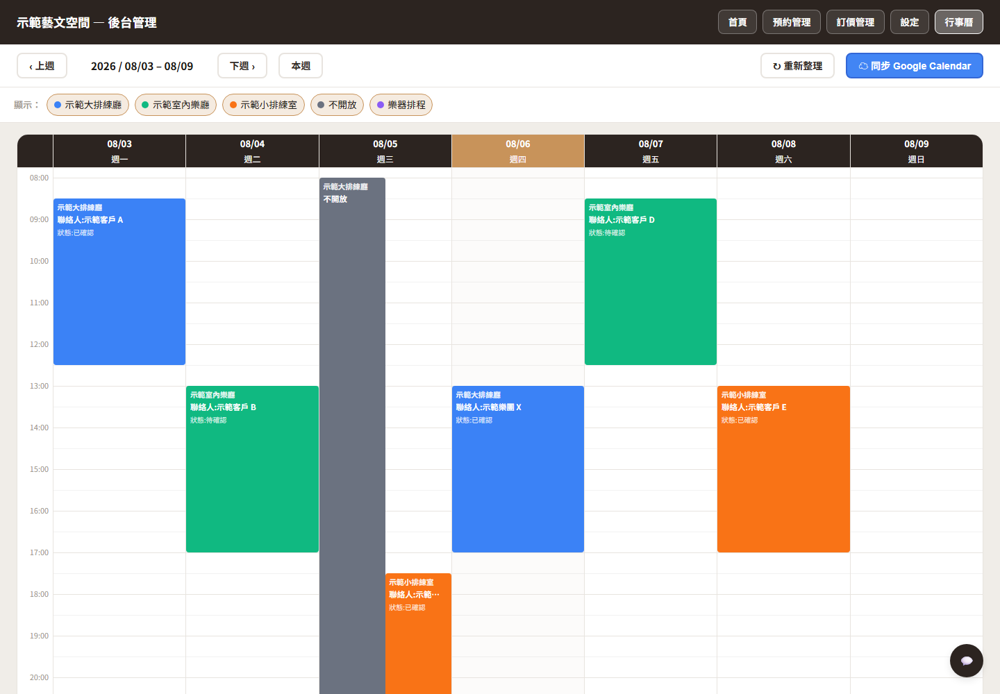

# Venue Booking and Administration - Case Study

## Anonymized Screens from the Deployed System

The images below are the deployed system's own interface (Traditional Chinese), rendered offline with the venue identity, pricing configuration and every production endpoint replaced, and fictional bookings injected in place of real data.

| Public booking flow | Administrative weekly schedule |
|---------------------|-------------------------------|
|  |  |

## Status

Deployed for operational use. Full production source and booking data remain private.

## Product Scope

- Public availability and booking requests
- Venue, date, time-slot, and add-on selection
- Administrative review and status management
- Maintenance and internal-use blocks
- Weekly schedule views
- Booking, payment, and activity summaries

## Technical Summary

The private system uses responsive HTML, CSS, and JavaScript with Apps Script and spreadsheet-backed operational integration.

## Public Demo

Open `demo.html`. It is offline and interactive: the booking flow lets you pick a venue, date, time slot and add-ons and watch the quotation recalculate, the administration tab filters requests, and the weekly schedule opens each booking. All events are anonymous and fictional.

## Disclosure Boundary

Apps Script endpoints, spreadsheet identifiers, customer contacts, booking records, pricing configuration, and production business logic are excluded.

